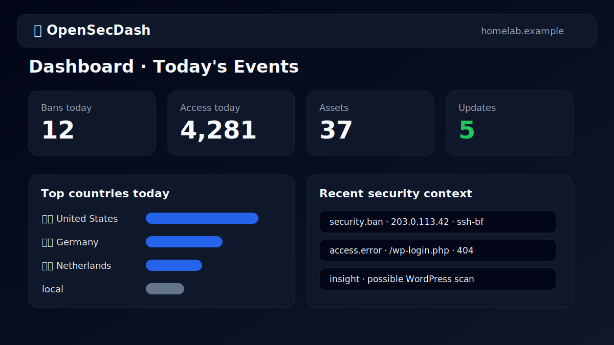
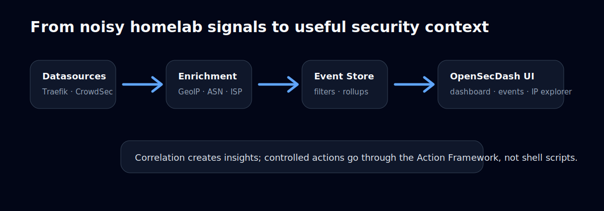
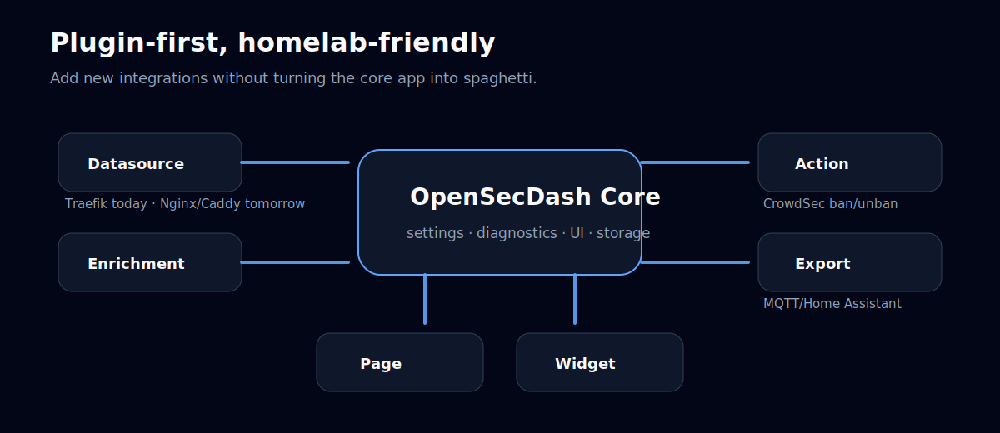

<p align="center">
  
</p>

# OpenSecDash

> A security dashboard for homelabs, because your reverse proxy logs should not require a PhD, three terminals, and a sacrificial YAML file to become useful.

OpenSecDash collects security events, access logs, asset information, and update signals from common homelab tools. It turns them into a simple, live-first web UI for answering practical questions:

- Who is knocking on my services?
- Which requests were blocked or failed?
- Which apps are installed in my homelab, and which of them need updates?
- What happened around a specific IP address?
- Are my plugins and datasources healthy?



OpenSecDash is open source and built for homelab enthusiasts who want security visibility without building a full observability platform first.

---

## OpenSecDash is not a Grafana replacement

Grafana is excellent at visualizing metrics, time series, dashboards, and complex observability data. OpenSecDash is intentionally different.

OpenSecDash focuses on **security-oriented context for homelabs**:

- event taxonomy instead of arbitrary metrics
- IP-centric investigation
- access-log and security-log correlation
- asset inventory and app update status
- plugin health and diagnostics
- controlled security actions such as CrowdSec ban/unban
- simple defaults for people running a few servers at home

Use Grafana when you want flexible charts, Prometheus metrics, long-term observability, and custom dashboards.

Use OpenSecDash when you want a focused answer to: **“What happened in my homelab security-wise, and should I do something about it?”**

They can happily live next to each other.

---

## What OpenSecDash does



OpenSecDash follows a simple flow:

```text
Datasources → Enrichment → Event Store → Correlation → Dashboard / Explorer / Actions
```

### Live-first dashboard

The dashboard gives you a quick overview of today’s activity:

- CrowdSec bans
- GeoBlock events
- access events
- assets and available updates
- top countries
- busiest attack/access hours
- recent security context

The Events page supports **Live** and **Snapshot** modes. Live mode keeps the UI fresh. Snapshot mode freezes the current view so you can filter and inspect without the table moving under your mouse.

### Events and access logs

OpenSecDash stores events with structured fields and optional raw data:

- event type, plugin, source
- IP address, country, ASN, ISP
- hostname, path, method, status code
- severity
- event timestamp
- plugin-specific JSON payload

Events use a stable taxonomy such as:

```text
access.allowed
access.denied
access.error
security.ban
security.geoblock
security.torblock
action.executed
action.failed
```

That makes filtering, correlation, and plugin development predictable.

### Search and filters

The Events and Access views support practical filters for homelab investigations:

- event type, including wildcards such as `access.*`
- IP address
- country code
- status code
- path
- plugin/source
- local-IP include/exclude behavior
- text search with boolean expressions such as:

```text
wp-login && (404 || 403)
```

Long values such as paths, URLs, user agents, and ISP names are truncated in tables and can be opened in an overlay.

### IP Explorer

The IP Explorer is the “what happened with this address?” view.

It combines:

- all events for the IP
- access attempts
- bans/geoblocks
- insights
- manual CrowdSec actions when enabled

For local/private IPs, destructive actions such as bans are intentionally disabled.

### Responsive UI for real homelab life

OpenSecDash is designed to work well beyond a large desktop monitor. That matters in a homelab, because you may check alerts from a phone on the couch, a tablet next to the rack, or a laptop while debugging a reverse proxy rule.

Responsive UI examples:

- **Dashboard cards adapt to the screen**: summary widgets stack on phones and spread out on wider displays.
- **Tables become readable on mobile**: dense event/access tables switch into label/value rows instead of forcing horizontal scrolling everywhere.
- **Long values stay usable**: URLs, paths, user agents, and ISP names are truncated in lists and can be opened in a touch-friendly overlay.
- **Column selection helps small screens**: hide less important columns on Events/Access pages and keep the view focused.
- **Touch-friendly actions**: buttons and toggles are sized for phones and tablets, not only mouse pointers.
- **Sticky navigation**: the app header remains easy to reach while moving through event-heavy pages.

This makes OpenSecDash practical as a lightweight “security control panel” you can keep open on a tablet or quickly check from your phone.

### Install it from your browser like an app

OpenSecDash includes a web app manifest, so modern browsers can add it as an app-like shortcut. This does not require an app store.

Example with Chrome or Edge on desktop:

1. Open your OpenSecDash URL, for example `https://opensecdash.example.com`.
2. Click the install icon in the address bar, or open the browser menu.
3. Choose **Install OpenSecDash** or **Apps → Install this site as an app**.
4. Pin it to your dock/taskbar if you like.

Example on iPhone/iPad with Safari:

1. Open OpenSecDash in Safari.
2. Tap **Share**.
3. Tap **Add to Home Screen**.
4. Launch it from the new home-screen icon.

Example on Android with Chrome:

1. Open OpenSecDash in Chrome.
2. Tap the three-dot menu.
3. Tap **Add to Home screen** or **Install app**.

For the best install experience, serve OpenSecDash through HTTPS via your reverse proxy.

### Insights and correlation

OpenSecDash creates simple rule-based insights from event patterns, for example:

- possible WordPress scans
- access errors followed by security bans
- geoblocked requests
- manually triggered security bans

The goal is not to be a SIEM. The goal is to surface useful context quickly.

### Asset Explorer

OpenSecDash can import an app inventory and show systems with installed applications.

The Asset Explorer helps answer:

- Which apps are installed where?
- Which apps have known newer GitHub releases?
- Which systems have apps with updates?
- Which access events are related to a known asset host?

Assets are meant to represent services or apps you consciously run, such as:

```text
Home Assistant
Nextcloud
Vaultwarden
Immich
Jellyfin
Traefik
Grafana
Uptime Kuma
```

They are not meant to be every container, VM, or IP address.

### GitHub release checks

For assets with GitHub release URLs, OpenSecDash can check the latest release and mark apps with available updates.

The update checker uses a GitHub token when configured, which is recommended to avoid rate limits.

### Plugin diagnostics

The Diagnostics page shows:

- registered plugins
- whether each plugin is enabled
- datasource status
- runtime diagnostics
- recent manual actions

This makes it easier to understand whether a missing event is a configuration issue, a disabled plugin, or a runtime error.

---

## Built-in plugins



OpenSecDash is plugin-first. The core app provides storage, UI, settings, diagnostics, actions, and helper services. Plugins provide integrations.

Current plugins include:

| Plugin | Capability | Purpose |
| --- | --- | --- |
| CrowdSec | datasource, action, page, widget | Import security decisions and trigger ban/unban actions |
| Traefik Access Log | datasource, page, widget | Import and classify access log entries |
| GeoBlock Log | datasource, widget | Import geoblock events |
| GeoIP / ASN / ISP | enrichment | Add country, ASN, and ISP metadata to public IP events |
| Apps Inventory | datasource, page, widget | Import installed apps and support update detection |
| MQTT to Home Assistant | export | Publish asset update information to Home Assistant via MQTT |

The plugin API is intentionally small. New datasource plugins, such as **Nginx** or **Caddy**, should be comfortable to build without changing the core app.

A plugin can declare capabilities such as:

```text
datasource
enrichment
action
export
page
widget
insight
```

Plugins also define their own settings and translations, and OpenSecDash renders them automatically on the Settings page.

---

## Important settings

OpenSecDash keeps the core settings simple.

### General

| Setting | What it does |
| --- | --- |
| Primary Domain | Shown as the identity of this OpenSecDash instance |
| Language | UI language; technical event identifiers stay unchanged |
| Retention days | How long raw events should be kept, depending on cleanup configuration |
| Default Events mode | Start the Events page in Live or Snapshot mode |
| Theme | Dark, light, or automatic browser/system theme |
| Timezone | Display timestamps in `auto`, `UTC`, or an IANA timezone such as `Europe/Berlin` |

### Actions

| Setting | What it does |
| --- | --- |
| Action simulation | Dry-run mode records actions without executing them |
| Execute via plugin | Allows configured action plugins to execute real actions |

Dry-run is the safer default. Only disable it when you trust and understand the configured action plugins.

### Logging

| Setting | What it does |
| --- | --- |
| Write log file | Enables an additional file log |
| Log file path | Path for the optional log file |
| Log level | `DEBUG`, `INFO`, `WARNING`, `ERROR`, or `CRITICAL` |

Service/journal logging remains available even when file logging is disabled.

### Plugin settings

Each plugin owns its own settings block. Most plugin-specific settings are hidden until the plugin is enabled.

Examples:

- log file paths
- datasource type
- GitHub token
- MQTT broker settings
- feature toggles

---

## Running OpenSecDash

### Docker Compose

A Docker Compose example is available in [`docker-compose.example.yml`](docker-compose.example.yml).

```bash
cp docker-compose.example.yml docker-compose.yml
docker compose up -d
```

Then open:

```text
http://localhost:8765
```

The container listens on port `8000` internally. The example maps it to host port `8765` to avoid common homelab conflicts:

```yaml
ports:
  - "8765:8000"
```

Persistent data is stored in `/data` inside the container. The default database URL is:

```text
sqlite:////data/opensecdash.db
```

### Local development

```bash
cd backend
uv run uvicorn app.main:app --reload --host 0.0.0.0 --port 8000
```

Then open:

```text
http://localhost:8000
```

For production-style homelabs, a reverse proxy is usually nicer:

```text
https://opensecdash.example.com → opensecdash:8000
```

---

## Development

Install dependencies and run tests:

```bash
cd backend
uv run pytest -q
uv run pyright ../backend/app ../backend/tests ../plugins
```

The test suite covers important app behavior and architectural decisions, including:

- event storage and deduplication
- rollups
- event taxonomy and severity mapping
- filters and boolean search
- asset inventory and update detection
- GeoIP enrichment behavior
- plugin metadata/settings/diagnostics
- action locking
- i18n key parity
- timezone formatting

---

## Contributing

Community contributions are very welcome.

Useful contribution areas include:

- datasource plugins for Nginx, Caddy, Authentik, Authelia, firewall logs, and more
- export plugins
- additional insights and correlation rules
- UI improvements
- documentation
- tests
- packaging and deployment examples

### Contributor License Agreement

To keep the project legally safe for everyone, contributors will be asked to confirm a lightweight CLA when opening a pull request.

The intent is simple:

- you keep ownership of your contribution
- you confirm that you are allowed to contribute it
- the project can use and distribute it as part of OpenSecDash

The confirmation should be quick and low-friction. No fax machine, no blood oath, no enterprise procurement portal.

See [docs/CLA.md](docs/CLA.md) for the contributor agreement text.

---

## Project status

OpenSecDash is actively evolving. APIs, plugin interfaces, and deployment packaging may still change before a stable 1.0 release.

If you run a homelab and have logs you wish were easier to understand, this project is for you.
