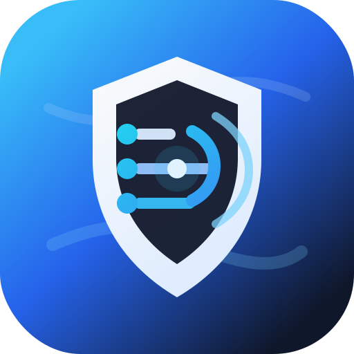
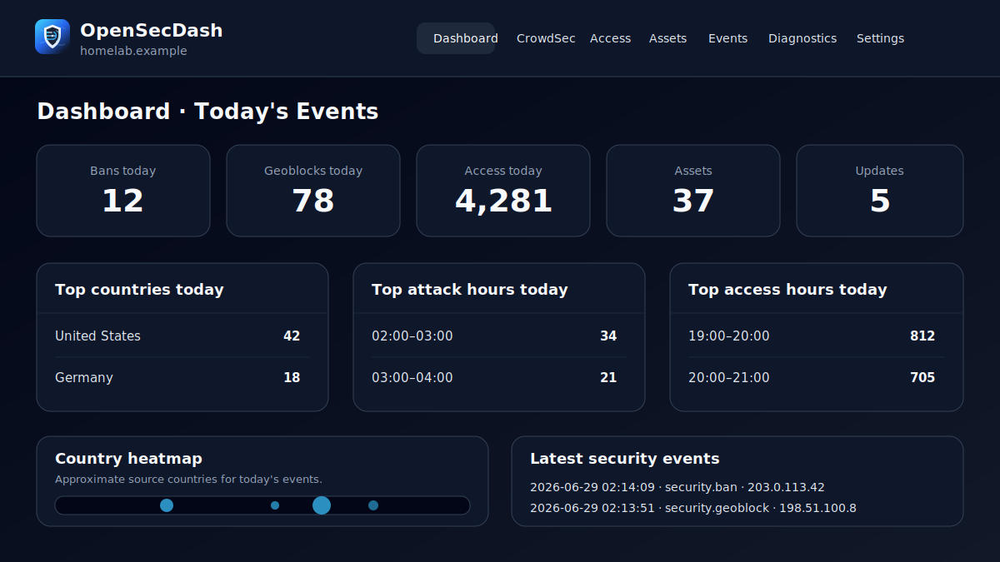

<p align="center">
  
</p>

# OpenSecDash

<p align="center">
  <a href="https://github.com/konkos1/OpenSecDash/actions/workflows/tests.yml"></a>
  <a href="LICENSE"></a>
  <a href="https://github.com/konkos1/OpenSecDash/releases"></a>
  <a href="https://hub.docker.com/r/konkos1/opensecdash"></a>
</p>

> A security dashboard for homelabs, because your reverse proxy logs should not require a PhD, three terminals, and a sacrificial YAML file to become useful.

OpenSecDash collects security events, access logs, asset information, and update signals from common homelab tools. It turns them into a simple, live-first web UI for answering practical questions:

- Who is knocking on my services?
- Which requests were blocked or failed?
- What happened around a specific IP address?
- Which apps are installed, and which need updates?
- Are my plugins and datasources healthy?



## Documentation

Full documentation lives at **https://opensecdash.app**:

- [Quickstart](https://opensecdash.app/guide/getting-started/quickstart)
- [Docker installation](https://opensecdash.app/guide/installation/docker)
- [Plugins](https://opensecdash.app/guide/plugins/)
- [Operations and troubleshooting](https://opensecdash.app/guide/operations/troubleshooting)
- [Contributing](https://opensecdash.app/guide/contributing/development)

The website source is in [`website/`](website/).

## Quickstart

Docker Compose is the recommended installation method.

```bash
cp docker-compose.example.yml docker-compose.yml
docker compose up -d
```

Then open `http://localhost:8765`.

See the [Docker installation guide](https://opensecdash.app/guide/installation/docker) for host requirements, ports, persistent data, and plugin file mounts.

## Built-in integrations

OpenSecDash includes plugins for CrowdSec, Traefik access logs, GeoBlock logs, GeoIP enrichment, JSON/Proxmox assets, and MQTT export.

See the [plugin documentation](https://opensecdash.app/guide/plugins/) for setup details.

## Security note

OpenSecDash currently does **not** include built-in user management or authentication.

Do **not** expose it directly to the public internet. Keep it on your LAN, behind a VPN, or behind a trusted auth reverse proxy such as Authentik, Authelia, Pocket ID, or another forward-auth solution.

## Development

See the [development guide](https://opensecdash.app/guide/contributing/development) for local setup, backend checks, and website development.

## Contributing

Community contributions are very welcome. Start with [CONTRIBUTING.md](CONTRIBUTING.md) and the [contributor documentation](https://opensecdash.app/guide/contributing/project).

Please do not open public issues for vulnerabilities. See [SECURITY.md](SECURITY.md) for responsible disclosure guidance.

### Contributor License Agreement

To keep the project legally safe for everyone, contributors will be asked to confirm a lightweight CLA when opening a pull request.

The intent is simple:

- you keep ownership of your contribution
- you confirm that you are allowed to contribute it
- the project can use and distribute it as part of OpenSecDash

The confirmation should be quick and low-friction. No fax machine, no blood oath, no enterprise procurement portal.

See [docs/CLA.md](docs/CLA.md) for the contributor agreement text.

---

## Project status

OpenSecDash is actively evolving. APIs, plugin interfaces, and deployment packaging may still change before a stable 1.0 release.

If you run a homelab and have logs you wish were easier to understand, this project is for you.

## License

OpenSecDash is released under the **GNU Affero General Public License v3.0**. See [`LICENSE`](LICENSE).
